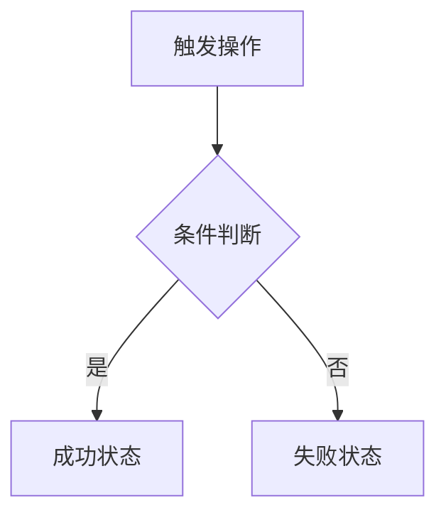

# Make Product Manual

## Overview

Generate a structured product manual (产品说明书) by following the standard template. Output a complete `.md` file covering revision history, product overview, hardware specs (optional), and software design with per-page module breakdowns and Mermaid flowcharts.

**Two working modes:**
- **Post-PM Mode** — pm-workflow has already produced feature points, wireframes, and high-fidelity UI. Use those directly as source material.
- **Standalone Mode** — No prior PM output. Gather information from user/context from scratch.

## Template Reference

The standard template is at the project root: `产品说明书模板.md`. Read it to understand the full structure before generating a manual.

## When to Use

- User asks to create a product manual / 产品说明书 / 产品文档
- User wants to document a product's features and workflows
- User provides feature descriptions and asks for a formal write-up
- User mentions "按模板生成说明书" or similar
- After pm-workflow completes and user wants formal documentation

---

## Mode A: Post-PM Mode（基于 PM 工作流产出的说明书）

If pm-workflow has been run in this conversation or its outputs exist on disk, use those directly. **Do NOT re-gather information that PM workflow already produced.**

### Step A1: Detect PM Outputs

Check for the following. Existence of any of them signals Post-PM Mode:

| PM 产出物 | 来源 | 用于说明书 |
|-----------|------|-----------|
| **功能点清单** | pm-workflow Step 1 确认后的功能点列表 | 作为软件设计章节的功能目录，逐条展开为模块-说明表格 |
| **线框图（HTML）** | pm-workflow Step 2 生成的静态线框图 | 每个页面的布局结构 → 说明书中的"模块"列的拆解依据 |
| **高保真 UI（HTML）** | pm-workflow Step 3 生成的高保真 UI | 每个页面的详细 UI 元素、文案、交互状态 → 说明书中的"说明"列内容 |
| **演示脚本** | pm-workflow Step 5 撰写的演示操作脚本 | 提炼业务流程，用于绘制 Mermaid 流程图 |
| **设计系统** | pm-workflow Step 2/3 调用的 ui-ux-pro-max 输出 | 产品名称、平台类型等信息 |

### Step A2: Extract from PM Outputs

直接从已有产出中提取，不再向用户重复询问：

| 所需信息 | 提取方式 |
|----------|----------|
| 产品名称 | 从功能点清单、UI 标题、演示脚本中提取 |
| 产品简介 | 综合功能点清单和演示脚本的定位描述 |
| 目标平台 | 从线框图/UI 的版式判断（竖屏 375px → 移动端；横屏 1280px → 大屏/PC端） |
| 功能清单 | 直接使用 pm-workflow Step 1 确认的功能点清单 |
| 业务流程 | 从演示脚本的操作流程和线框图的页面跳转关系推导 |
| 版本信息 | 如无则询问用户 |

### Step A3: Read PM Output Files

在撰写前，实际读取以下文件以获取详细内容：

1. **UI HTML 文件** — 解析每个页面的模块结构、文案、交互元素
2. **功能点清单** — 确认功能边界和分组
3. **演示脚本** — 提取操作流程用于 Mermaid 流程图

然后按模板章节填充，每个功能页的模块-说明表格直接来源于 UI 文件中的元素拆解。

### Step A4: Fill Remaining Gaps

PM 工作流通常不覆盖以下内容，需要额外询问或标注：

- **硬件参数**（如有）：PM 流程不涉及硬件，需单独询问
- **修订历史**：当前版本信息
- **读者须知**：按模板默认值填充

### Step A5: Output

保存为 `[产品名称]产品说明书.md`，告知用户文件路径。

---

## Mode B: Standalone Mode（独立模式，无 PM 产出）

When no PM workflow outputs exist, gather information from scratch.

### Step B1: Gather Information

Ask the user for the following minimum inputs:

| 信息项 | 说明 |
|--------|------|
| **产品名称** | 产品的正式名称 |
| **产品简介** | 一句话核心定位和核心能力 |
| **目标平台** | 有哪些端（大屏端 / 移动端 / PC端 / Web端） |
| **功能清单** | 每个端有哪些功能页面，各自包含哪些 UI 模块 |
| **业务流程** | 核心业务的操作流程（用于画 Mermaid 流程图） |
| **硬件参数**（可选） | 有硬件则提供型号、尺寸、屏幕、CPU 等 |
| **版本信息** | 版本号、修订人 |

### Step B2: Structure the Document

Follow this exact chapter hierarchy:

```
# [产品名称]产品说明书
## 修订历史（表格）
## 1. 产品概述
### 1.1 产品简介
### 1.2 文档阅读对象
### 1.3 读者须知
## 2. 硬件说明（纯软件产品省略）
### 硬件清单（表格）
## 3. 软件设计
### 3.1 整体业务流程（含 Mermaid 流程图）
### 3.2 [端名称] 软件操作流程
#### 3.2.1 [页面/功能名称]（模块-说明表格 + 截图占位）
#### 3.2.2 ...（每个功能页一节）
### 3.3 [另一端名称] 软件操作流程
#### 3.3.1 ...
## 附录（可选）
```

### Step B3: Fill Each Section

**修订历史：** 表格，至少包含当前版本一行。

**产品概述：** 用简练的语言描述产品定位和读者群体。注意保持客观，不做宣传性描述。

**硬件说明：** 如有硬件，用参数表格列出。纯软件产品直接写 `> 纯软件产品，本章节省略。`

**软件设计 — 整体业务流程：** 用 Mermaid `flowchart TD` 画端到端业务流程图，覆盖所有平台。

**软件设计 — 逐页说明：** 每个功能页面按以下顺序组织：
- **截图占位符**在最前面：`> **[图：xxx截图]**`
- 然后是 **Mermaid 流程图**（如有操作流程分支）
- 最后是 **模块-说明表格**（列：模块名称、功能说明/交互逻辑/文案内容）

**顺序原则：先图后表。** 读者先看截图建立直观印象，再看表格对照每个模块的说明。

**说明列撰写原则：只写功能，不写设计。** 说明列描述"这个模块做什么、为什么存在、用户能干什么"，禁止写入设计实现细节。具体规则：

| 禁止写入（设计细节） | 应写（功能说明） |
|----------------------|------------------|
| 颜色值（rgba、#fff、#1979FE） | 该模块的功能用途 |
| 像素尺寸（24px、12px、375px） | 点击后的跳转目标或行为 |
| CSS 属性（圆角、阴影、flex、grid） | 在不同状态下的内容变化 |
| 动画描述（旋转动画、弹入动画） | 触发条件与消失条件 |
| 字体规格（字号 14px、字重 600） | 文案内容或示例 |

**判断标准：** 如果一句话去掉颜色/尺寸/CSS/动画后仍然有意义，就只保留剩余部分；如果去掉后完全没有信息量，说明这个模块本质是纯视觉装饰，可以合并到相邻功能模块中。

**软件设计 — 状态覆盖：** 确保覆盖所有状态：
- 初始/默认态
- 操作中/加载态
- 有数据/成功态
- 空数据/失败态

**附录：** 根据需要添加术语表、FAQ、更新日志。**禁止在附录中添加页面跳转关系表**——各模块的跳转目标已在对应说明列中描述，重复列出属于冗余。

---

## Shared: Mermaid Flowcharts

两种模式共用此规则。图片截图只做占位（`> **[图：xxx]**`），流程逻辑必须用 Mermaid 表达：



常用元素：
- `A[矩形节点]` — 流程步骤
- `B{菱形节点}` — 条件分支
- `-->|标签|` — 带条件标签的箭头

---

## Output

将生成的说明书保存为 `[产品名称]产品说明书.md`，放在用户指定的目录（默认项目根目录）。

完成后告知用户文件路径，并提醒截图占位需要手动替换为实际截图。

---

## Cross-References

- **pm-workflow**：本 skill 的 Post-PM Mode 可消费 pm-workflow 的产出（功能点清单、线框图、高保真 UI、演示脚本），无需重复收集信息
- **产品说明书模板.md**：标准模板文件，撰写前先读取了解完整结构

---

## Common Mistakes

| 错误 | 正确做法 |
|------|----------|
| PM 产出已存在还从头询问信息 | 先检查上下文和磁盘，优先使用已有产出 |
| 只写模块名不写说明 | 每个模块必须有功能说明、交互逻辑、文案内容 |
| 忽略异常/空数据状态 | 每个功能至少覆盖：正常态 + 异常态 |
| 流程图只放截图 | 流程逻辑用 Mermaid 表达，截图做补充占位 |
| 硬件说明照搬模板 | 先确认是否有硬件，纯软件产品直接省略 |
| 混淆端与功能页 | 先按"端"分章，再按"功能页"分节 |
| 说明列写入设计细节（颜色/尺寸/CSS/动画） | 只写功能用途、交互行为、触发条件，设计细节属于 UI 稿而非说明书 |
| 截图放在表格下面 | 先图后表，读者先看截图建立印象，再对照表格阅读模块说明 |
| 附录中列出页面跳转关系表 | 跳转信息已在各模块说明列中描述，附录不重复列出 |
