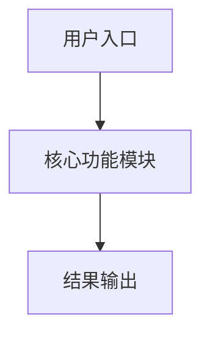
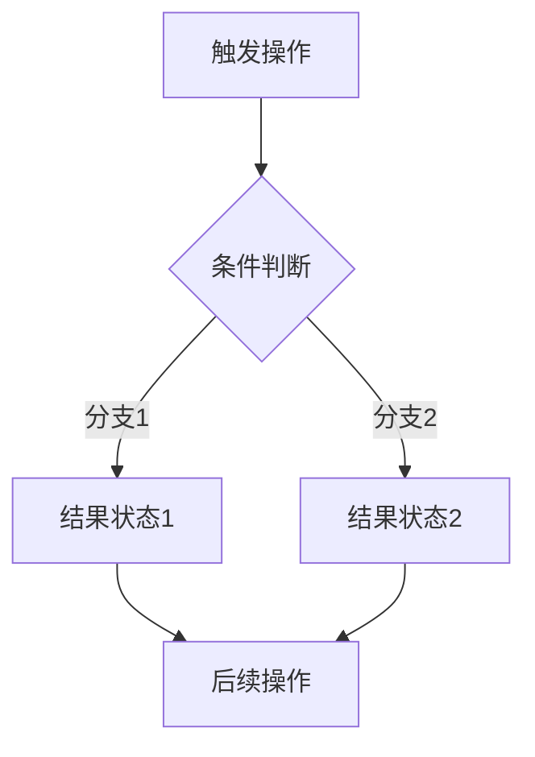

# 产品说明书模板

---

## 修订历史

| 版本号 | 修订日期 | 修订人 | 修订内容 |
|--------|----------|--------|----------|
| [版本号] | [YYYY-MM-DD] | [姓名] | [本次修订内容概述] |

---

## 1. 产品概述

### 1.1 产品简介
[产品的一句话定位描述，核心能力和价值主张]

### 1.2 文档阅读对象
[说明本文档的目标读者群体，如：产品经理、开发人员、测试人员、运营人员、客户等]

> 注意：本文只负责客观准确阐述本产品实际情况，不涉及对外宣传内容。

### 1.3 读者须知
[文档阅读注意事项，如：文案与 UI 图不一致时以本文为准、涉及术语说明等]

---

## 2. 硬件说明

> *（如为纯软件产品，此章节可省略）*

### 硬件清单

| 参数项 | 规格/说明 | 备注 |
|--------|-----------|------|
| 硬件名称（内部命名） | [型号/代号] | |
| 尺寸（宽×深×高 mm） | [尺寸] | |
| 屏幕尺寸 | [尺寸] | |
| 屏幕类型 | [如：电容触摸屏] | |
| 分辨率 | [分辨率] | |
| CPU | [处理器型号及参数] | |
| [其他参数项] | [规格说明] | |

---

## 3. 软件设计

### 3.1 整体业务流程

> *如有 UI 截图，在此处放置：* `> **[图：整体业务流程图]**`

---

### 3.2 [端名称，如：大屏端 / PC端] 软件操作流程

以下按功能模块逐页说明。

#### 3.2.1 [页面/功能名称，如：首页]

> **[图：对应页面功能截图]**

| 模块 | 说明 |
|------|------|
| [区域1名称] | [该区域的功能说明、展示内容、交互逻辑] |
| [区域2名称] | [该区域的功能说明、展示内容、交互逻辑] |
| [区域3名称] | [该区域的功能说明、展示内容、交互逻辑] |

#### 3.2.2 [页面/功能名称]

> **[图：对应页面功能截图]**

| 模块 | 说明 |
|------|------|
| [UI 模块名称] | [模块功能描述、尺寸、内容、交互行为] |
| [UI 模块名称] | [模块功能描述、尺寸、内容、交互行为] |

#### 3.2.3 [页面/功能名称]

**流程图：**

> **[图：对应页面功能截图]**

| 模块 | 说明 |
|------|------|
| [模块名称] | [功能说明] |

#### 3.2.4 [页面/功能名称 — 加载/中间状态]

> **[图：对应状态截图]**

| 模块 | 说明 |
|------|------|
| [状态提示模块] | [加载文案、动画说明、触发条件、出现时机] |

#### 3.2.5 [页面/功能名称 — 有数据状态]

> **[图：对应页面功能截图]**

| 模块 | 说明 |
|------|------|
| [标题区域] | [页面标题文案] |
| [提示文案区域] | [引导操作提示] |
| [数据列表区域] | [列表项结构说明、字段定义] |

#### 3.2.6 [页面/功能名称 — 空数据/无结果状态]

> **[图：对应页面功能截图]**

| 模块 | 说明 |
|------|------|
| [提示文案区域] | [空状态提示文案及引导建议] |
| [操作按钮区域] | [按钮文案、点击后的跳转行为] |

---

### 3.3 [端名称，如：移动端] 软件操作流程

#### 3.3.1 [页面名称]

> **[图：对应页面功能截图]**

| 模块 | 说明 |
|------|------|
| [状态栏] | [系统状态栏说明] |
| [页面标题] | [标题文案与标识] |
| [功能入口1] | [入口名称、图标、说明文案、点击行为] |
| [功能入口2] | [入口名称、图标、说明文案、点击行为] |
| [功能入口3] | [入口名称、图标、说明文案、点击行为] |

#### 3.3.2 [页面名称 — 初始/操作前状态]

> **[图：对应状态截图]**

| 模块 | 说明 |
|------|------|
| [标题区域] | [页面标题及附属信息] |
| [引导提示区域] | [引导文案与示例内容] |
| [核心操作控件 — 初始态] | [按钮文案、样式、位置、触发逻辑] |

#### 3.3.3 [页面名称 — 操作中/后状态]

> **[图：对应状态截图]**

| 模块 | 说明 |
|------|------|
| [核心操作控件 — 激活态] | [状态变化、动画/动效说明] |
| [输入/编辑区域] | [输入框样式、交互逻辑、键盘唤起] |
| [提交控件] | [发送按钮样式、点击行为] |
| [取消控件] | [取消按钮样式、点击行为（清空内容退出）] |
| [结果反馈 — 成功态] | [成功标识 + 提示文案 + 时间戳等] |
| [结果反馈 — 失败态] | [失败标识（红色）+ 错误文案 + 时间戳] |

---

## 附录（可选）

- [附加的技术参数表]
- [术语表 / 缩略词表]
- [常见问题 FAQ]
- [更新日志]
