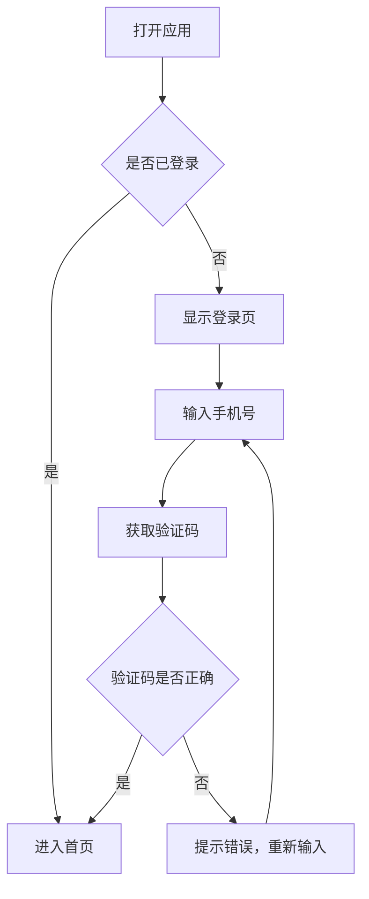

# 流程图示例

## 用户登录流程

## 结构说明

| 元素 | 写法 | 用途 |
|------|------|------|
| `A[文本]` | 方括号 | 流程节点（矩形） |
| `B{文本}` | 花括号 | 判断/分支（菱形） |
| `-->` | 实线箭头 | 流程走向 |
| `-->|条件|` | 带标签箭头 | 条件分支说明 |

> 更多语法参考：[Mermaid 官方文档](https://mermaid.js.org/syntax/flowchart.html)
